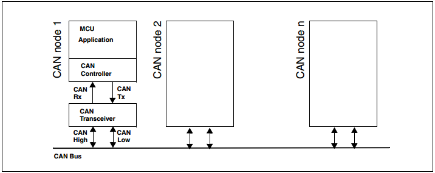
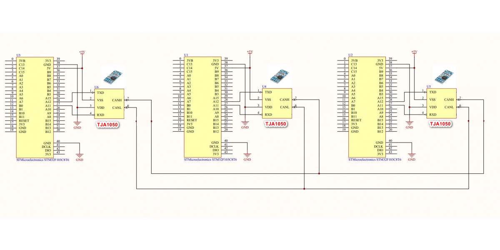
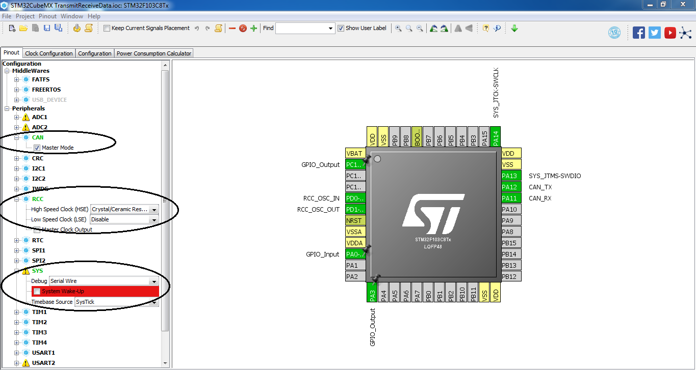
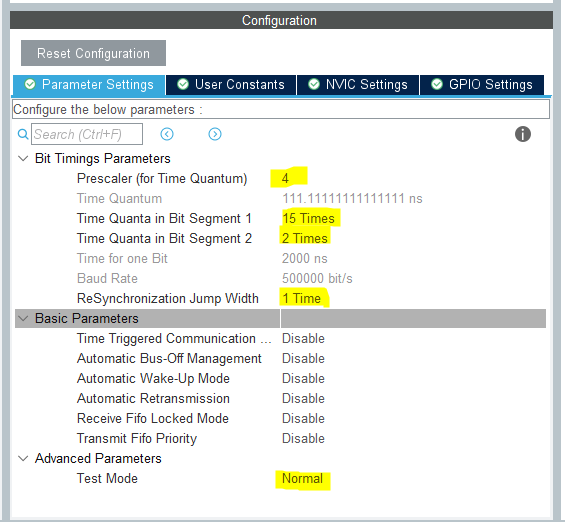
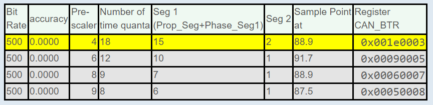
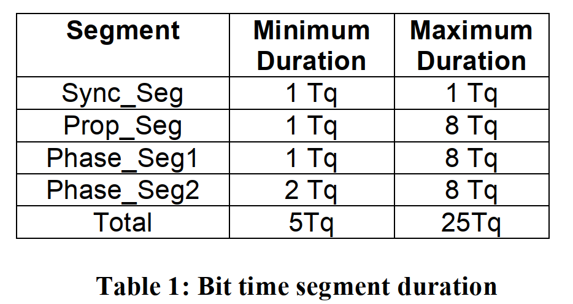

# STM32_HAL Giao tiếp CAN

Mỗi CAN node là một vi điều khiển (microcontroller – MCU) kết nối với một bộ điều khiển CAN (CAN – Controller). Bộ điều khiển CAN sẽ được kết nối với bộ chuyển đổi (hay bộ truyền-nhận) CAN – Transceiver thông qua 2 đường CAN Tx và CAN Rx. Chức năng của bộ chuyển đổi này là để chuyển đổi từ tín hiệu số trên đường TX thành tín hiệu tương tự trên bus CAN và chuyển đổi từ tín hiệu tương tự trên bus CAN (CAN_H và CAN_L) thành tín hiệu số trên RX.



## Bước 1: Kết nối phần cứng

Trong project này sử dụng 3 module STM32F103C8T6, 3 Module TJA1050 (CAN Transceiver), 3 led đơn. Dưới đây là sơ đồ kết nối board STM32F103C8T6 với IC CAN Transceiver. 



## Bước 2: Thiết lập cấu hình trên Cube MX





Có thể tính các gia trị được đánh dấu bằng các cách:

1. Nhập và tính toán bằng trang web: [CAN Bit Time Calculation](http://www.bittiming.can-wiki.info/)

Chọn program the controller: ST Microelectronics bxCAN

Clock Rate: 36 MHz

SJW ( Synchronization Jump Width): 1	SJK điều chỉnh một bit clock đi 1-4 TQ (được khởi tạo trước trong thanh ghi và không đổi trong quá trình hoạt động) để thực hiện việc đồng bộ với message truyền.

Chọn Baud rates: 500 kbit/s

Web sẽ sinh ra 1 bảng các lựa chọn cấu hình trong đó dòng bôi màu vàng là dòng đề xuất nên dùng:



Type: bxCAN, Clock: 36MHz, max brp: 1024, SP: 87.5%, min tq: 8, max tq: 25, FD factor: undefined, SJW: 1   

2. Sử dụng file excel

3. Tính thủ công bằng công thức


```math
baud rate = F_APBclock / Prescaler*(RJW + Seg1 + Seg2)
```

Resynchronization Jump Width (RJW) also called as Synchronization Jump Width (SJW).

Giới hạn của các thông số cho trong bảng:



